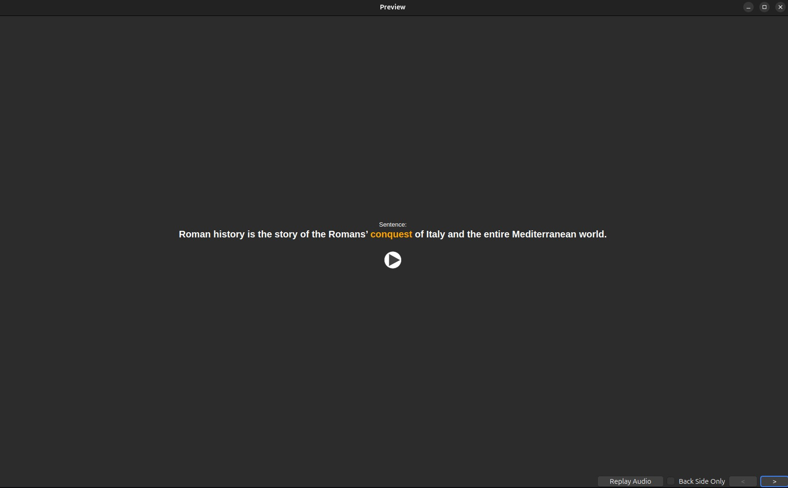
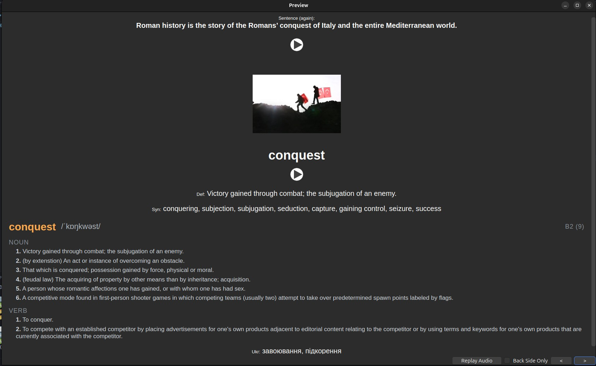
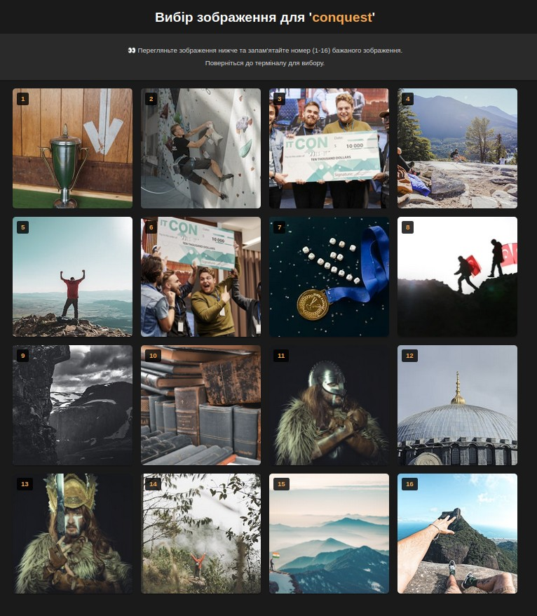

# 🃏 AnkiCardsToolkit


## 🧭 Project Overview

**AnkiCardsToolkit** automates the creation of rich, bilingual Anki flashcards for effective English vocabulary memorization.  
It combines audio pronunciation, imagery, CEFR level, frequency data, and synonym support in a single streamlined workflow.

## ✨ Key features:
- 🔊 Generates pronunciation audio using TTS (Text-to-Speech)
- 🖼️ Finds relevant images from the free Pexels library
- 📊 Adds CEFR level and frequency category to the card
- 📖 Fetches dictionary definitions and synonyms
- 🌐 Multi-language user interface (English and Ukrainian supported)
- 🧠 Focused word memorization from full sentence context
- 📋 Automatically reads the sentence from the clipboard
- ⚙️ Smart command-line interface with interactive prompts and robust error feedback
- 🪄 Generates ready-to-use HTML front/back templates for Anki

This tool is ideal for English learners and language autodidacts who want full control over the content of their vocabulary cards.

## 📑 Table of Contents

- [🖼️ Screenshots](#-screenshots)
- [⚙️ User Interaction Workflow](#-user-interaction-workflow)
- [🛠️ Installation](#-installation)
  - [➤ For Linux/macOS:](#-for-linuxmacos)
  - [➤ For Windows:](#-for-windows)
  - [➤ Generate 1-second Silent Audio](#-generate-1-second-silent-audio)
  - [➤ NLTK resources](#-nltk-resources)
  - [➤ Environment Configuration](#-environment-configuration)
  - [➤ Enable Image Support (Pexels API)](#-enable-image-support-pexels-api)
  - [➤ Enable Word Associations (Big Huge Thesaurus API)](#-enable-word-associations-big-huge-thesaurus-api)
  - [➤ Using the Card Templates in Anki](#-using-the-card-templates-in-anki)
  - [➤ Required Fields in Anki](#-required-fields-in-anki)
  - [➤ Deck Selection and Persistence](#-deck-selection-and-persistence)
  - [➤ Optional: Generating a Custom Silence MP3](#-optional-generating-a-custom-silence-mp3)
- [🚀 Running the Toolkit](#-running-the-toolkit)
  - [➤ Install Anki](#-install-anki)
  - [➤ Install AnkiConnect Add-on](#-install-ankiconnect-add-on)
  - [➤ Launch the Toolkit](#-launch-the-toolkit)
  - [➤ Image Integration via Pexels](#-image-integration-via-pexels)
  - [➤ Replacing Images Manually](#-replacing-images-manually)
  - [➤ Duplicate Card Detection](#-duplicate-card-detection)
  - [➤ Interrupting the Process](#-interrupting-the-process)
- [🌐 Set the Language (Optional)](#-set-the-language-optional)
- [📡 Internet Access, Anki Profile & Media Storage](#-internet-access-anki-profile--media-storage)
  - [➤ Anki Profile: `User 1`](#-anki-profile-user-1)
  - [➤ TTS Audio Generation](#-tts-audio-generation)
- [📊 CEFR & Frequency Integration](#-cefr--frequency-integration)
  - [➤ How the data is built](#-how-the-data-is-built)
- [🎓 Best Practices for Using This Toolkit with Anki](#-best-practices-for-using-this-toolkit-with-anki)
  - [➤ Card Creation Guidelines](#-card-creation-guidelines)
  - [➤ Card Review Strategy](#-card-review-strategy)
  - [➤ How Often to Create and Review](#-how-often-to-create-and-review)
- [🧾 License](#-license)


## 🖼️ Screenshots

Here’s what your flashcards will look like:

**🔹 Front side**  
Shows the sentence with the focus word highlighted and audio playback.



**🔸 Back side**  
Includes:
- The same sentence
- Relevant image
- Focus word with:
  - Pronunciation & transcription
  - CEFR level and frequency band
  - Dictionary definition
  - Synonyms, related/similar words, antonyms
  - Ukrainian translation

  

## ⚙️ User Interaction Workflow

This is what a typical interaction looks like when generating a new flashcard from a sentence:

```bash
(venv) $ python3 generate_card.py
Enter deck name [Default]: 
📋 Copied sentence:
Roman history is the story of the Romans’ conquest of Italy and the entire Mediterranean world.
Is it correct? [Press Enter to confirm or type again]: 

🔤 Enter the word you want to study: conquest

📝 Part of speech [noun] [Press Enter to confirm or change (noun/verb/adjective/adverb)]:

🔍 Querying Big Huge Thesaurus for 'conquest'...
✅ Received response from Big Huge Thesaurus

🔍 Searching for relevant images...
✅ Found 16 images — opening browser preview...

🔢 Enter a number (1–16) or press Enter to skip: 6
✅ Image selected successfully
```

  

```bash
📝 Enter the Ukrainian translation:
🔤 Enter translated words (separate with commas)): завоювання, підкорення

📁 File tts_conquest.mp3 saved  
📁 File tts_sentence_conquest.mp3 saved

✅ Card added: ID = 1749913745076
```


## 🛠️ Installation

To get started, clone the repository and set up a virtual environment:

### ➤ For Linux/macOS:

```bash
git clone https://github.com/OlegOKovalyov/anki-cards-toolkit.git
cd anki-cards-toolkit

# Create and activate a virtual environment
python3 -m venv venv
source venv/bin/activate

# Install project dependencies
pip install -r requirements.txt
```

### ➤ For Windows:
```bash
git clone https://github.com/OlegOKovalyov/anki-cards-toolkit.git
cd anki-cards-toolkit

:: Create and activate a virtual environment
python -m venv venv
venv\Scripts\activate

:: Install project dependencies
pip install -r requirements.txt
```
> ✅ Tip: Make sure to activate the virtual environment each time you work on the project or run the app:
```bash
source venv/bin/activate      # on Linux/macOS
venv\Scripts\activate         # on Windows
```

> ℹ️ **Note:** After activating the virtual environment, your terminal prompt should look like this:
> ```
> (venv) user@machine:~/anki-cards-toolkit$
> ```
> This indicates that you're working inside the virtual environment.

### ➤ Generate 1-second Silent Audio

To add a natural pause between sentence and word in the flashcard audio, run:

```bash
python scripts/generate_silence.py
```
This will create a 1-second silent MP3 used automatically in all cards.

### ➤ NLTK resources

This project uses NLTK lemmatization (WordNet).  
After installing dependencies, run the following once:

```bash
python scripts/install_nltk_data.py
```

### ➤ Environment Configuration

Before using the app, create a `.env` file in the project root with the following content:

```env
MODEL_NAME=VocabCard_English_UA
DECK_NAME=Default
PEXELS_API_KEY=your_pexels_api_key
BIG_HUGE_API_KEY=your_big_huge_thesaurus_key
ANKI_CONNECT_URL=http://localhost:8765
CONFIG_FILE=last_deck.txt
USER_LOCALE=uk
```
🗂️ The .env file is ignored by Git (via .gitignore) and must not be committed.

> 💬 USER_LOCALE controls interface language (uk, en, etc.).
If not set, the app will ask you to choose a language on first launch.

🔧 Configuration is loaded using the python-dotenv package.

### ➤ Enable Image Support (Pexels API)

To automatically fetch images from [Pexels.com](https://www.pexels.com/api/):

1. Create a free account and get your API key.
2. Add it to your `.env` file:
   ```env
   PEXELS_API_KEY=your_actual_pexels_api_key_here

### ➤ Enable Word Associations (Big Huge Thesaurus API)

To fetch synonyms and related words:

1. Get a free API key at [words.bighugelabs.com](https://words.bighugelabs.com/site/api).
2. Add it to your `.env` file:
   ```env
   BIG_HUGE_API_KEY=your_api_key_here

### ➤ Using the Card Templates in Anki

The project includes two HTML templates in /templates/:
  - front_template.html — front side of the card
  - back_template.html — back side of the card

To use them in Anki:
  1. In Anki, go to Browse → Cards (or press Ctrl+L)
  2. Create a new card type (based on “Basic”)
    🔒 **Important:** The card type name must be exactly `VocabCard_English_UA`

  3. Copy the contents from the two files into the **Front Template** and **Back Template** tabs
>💡 The back side includes a silent audio `[sound:silence_1sec.mp3]` to add a natural pause before the focus word:

```html
<div style="display: none;">
  <!-- Adding a silent audio file to create a pause -->
  [sound:silence_1sec.mp3]
</div>
```

### ➤ Required Fields in Anki

Your custom card type `VocabCard_English_UA` must contain specific fields so the toolkit can insert all generated content correctly.

📋 **Create these fields** (in this order recommended by the project):

1. `Word` *(⚠️ Should be first — required by Anki to avoid empty note errors)*
2. `Sentence`
3. `Sentence_Audio`
4. `Definition`
5. `Synonyms`
6. `Related`
7. `Similar`
8. `Antonyms`
9. `Sentence_Repeated`
10. `Image`
11. `Irregular_Forms` *(optional, for irregular verbs)*
12. `Word_Audio`
13. `Dictionary_Entry`
14. `Translation_UA`
15. `Front` *(Anki default — not used by this toolkit)*
16. `Back` *(Anki default — not used by this toolkit)*

🛠️ **How to add fields**:

1. Open Anki → **Browse** → **Cards**  
2. Click **Fields...**  
3. Add fields manually in the listed order

💡 **Tip:** Anki skips empty fields automatically, so optional data won’t break your templates.

### ➤ Deck Selection and Persistence

The toolkit lets you choose an Anki deck dynamically when creating a card.

🧠 What happens:

1. You'll be asked to type the **Anki deck name** manually.
2. The last used deck (stored in `last_deck.txt`) is suggested as default.
3. If the deck doesn’t exist, it will be **created automatically**.

💡 Just press `Enter` to reuse the previous deck name — perfect for batch card creation.

Example deck names:
- `English - Mood Food`
- `History - Chapter 01`


### ➤ Optional: Generating a Custom Silence MP3
By default, the app uses a 1-second silent MP3 for smooth audio playback.
To change the pause duration, edit the scripts/generate_silence.py script:
```py
generate_silence(duration_ms=2000)  # ← 2 seconds
```
Then re-run the script to regenerate the file:
```bash
python scripts/generate_silence.py
```

## 🚀 Running the Toolkit

Before generating Anki flashcards, make sure everything is ready:

---

### ➤ Install Anki

Download and install Anki from the official site:  
👉 https://apps.ankiweb.net/

🟢 **Important:** Anki must be running in the background during flashcard generation.

---

### ➤ Install AnkiConnect Add-on

This toolkit communicates with Anki via [AnkiConnect](https://github.com/FooSoft/anki-connect).

📦 To install:
1. Open Anki
2. Go to `Tools → Add-ons → Get Add-ons…`
3. Paste this code: `2055492159`
4. Click OK and restart Anki

🟢 After installation, AnkiConnect listens at `http://localhost:8765`

---

### ➤ Launch the Toolkit

Make sure:
- Anki is running
- AnkiConnect is installed and enabled
- You’re connected to the internet

Then run:

```bash
source venv/bin/activate  # or venv\Scripts\activate.bat on Windows
python generate_card.py
```

## 🌐 Set the Language (Optional)

You can choose the interface language (English or Ukrainian) using:
```bash
python generate_card.py --set-language
```
Or the short version:
```bash
python generate_card.py -l
```
> If the language is not set, the app will prompt you to choose one on the first launch.

Your preference will be saved in the .env file as USER_LOCALE.

## 📡 Internet Access, Anki Profile & Media Storage

This toolkit requires an **active internet connection** to:
- Get synonyms and definitions (Big Huge Thesaurus)
- Fetch images (Pexels)
- Generate audio (TTS)

---

### ➤ Anki Profile: `User 1`

By default, Anki uses a profile called **User 1**.  
All media (audio, images, silence) is saved in:

• **Linux/macOS**:  
```bash
~/.local/share/Anki2/User 1/
```
• **Windows**: 
```bash
C:\Users\<YourUsername>\AppData\Roaming\Anki2\User 1\
```
> 💡 If you rename your profile in Anki, the folder name will change accordingly.

### ➤ TTS Audio Generation

The tool uses **gTTS (Google Text-to-Speech)** to generate two audio files per card:
- `tts_<word>.mp3`
- `tts_sentence_<word>.mp3`

🗂️ Saved to Anki's media folder:
```bash
~/.local/share/Anki2/User 1/collection.media/
```
🗑️ If a card is deleted or updated, audio may be moved to:
```bash
~/.local/share/Anki2/User 1/collection.media/media.trash/
```

### ➤ Image Integration via Pexels

Anki cards display images using **direct links** from [Pexels](https://www.pexels.com/).  
Images are **not downloaded**, only embedded via URL.

💡 This means:
- No local storage is used
- Internet is required during card review

Example snippet:
```html

```

### ➤ Replacing Images Manually

Unsatisfied with the auto-selected image?

You can easily change it in Anki:

1. Open the card in **Edit** mode.
2. Replace the `` link with any valid image URL.

Example:
```html

```
> ✅ Your image will now be shown during flashcard reviews.

### ➤ Duplicate Card Detection

> ❗ If you enter a focus word that already exists as the front side of a card in any deck, Anki will prevent the creation of a duplicate card and return an error. This is default behavior of AnkiConnect to avoid unintended duplicates across your entire collection.

### ➤ Interrupting the Process

> ❗ If at any point something goes wrong — e.g., you mistakenly enter a focus word instead of confirming the sentence — you can safely stop the process with `Ctrl+C`. This allows you to restart from the beginning without creating a broken or incomplete card.


## 📊 CEFR & Frequency Integration

Each word in your flashcards is enriched with:

- **CEFR level** (A1–C2)
- **Frequency category** (1–9)

This data comes from a merged file: `data/merged_cefr_frequency.csv`.
It is used automatically during card creation.

### ➤ How the data is built

The merged file is created from two open-source CSVs:

- `word_list_cefr.csv`
- `valid_words_sorted_by_frequency.csv`

Source:  
[Maximax67 / Words-CEFR-Dataset](https://github.com/Maximax67/Words-CEFR-Dataset)

To regenerate the merged file:

```bash
cd data/
wget https://raw.githubusercontent.com/Maximax67/Words-CEFR-Dataset/main/csv/word_list_cefr.csv
wget https://raw.githubusercontent.com/Maximax67/Words-CEFR-Dataset/main/csv/valid_words_sorted_by_frequency.csv
python3 merge_cefr_and_frequency.py
```

🧮 Output format

```cs
Word,CEFR,Frequency
abandon,B2,4
about,A1,2
acquaintance,?,6
```
- CEFR: A1–C2 or ? if not found
- Frequency: Category from 1 (most frequent) to 9 (rare)

| Category | Frequency Range     |
| -------- | ------------------- |
| 1        | 10,000 – 17,000     |
| 2        | 17,000 – 30,000     |
| 3        | 30,000 – 50,000     |
| 4        | 50,000 – 100,000    |
| 5        | 100,000 – 170,000   |
| 6        | 170,000 – 300,000   |
| 7        | 300,000 – 800,000   |
| 8        | 800,000 – 3,000,000 |
| 9        | 3,000,000 and above |

> ⚠️ Only the final merged file is committed to the repo.
Source CSVs and merging script are kept locally (not versioned).

## 🎓 Best Practices for Using This Toolkit with Anki

To make the most of your vocabulary learning with Anki and this toolkit, consider the following workflow and usage tips:

### ➤ Card Creation Guidelines

1. 📋 **Copy a sentence** to your clipboard from any source: textbook, article, video, podcast, etc.

2. ▶️ **Run the script**:
   ```bash
   python3 generate_card.py
   ``` 
3. 🗂️ Enter the deck name:
    - Press Enter to reuse the previous deck
    - Or type a new one manually
    > ⚠️ Do not copy the deck name — the clipboard should contain only the sentence.

4. 🎯 Choose your focus word — the one you want to learn.
5. 🧠 The toolkit builds a flashcard using the VocabCard_English_UA type, with:
    - Sentence (with TTS audio)
    - Focus word (with translation, definition, CEFR & frequency)
    - Synonyms, antonyms, related words
    - Image (optional)
    - Word and sentence audio (with pause)

🔖 Example Deck Names

Group flashcards by topic or source for better review:
- English File – Unit 2
- TV Series – Breaking Bad
- History – Ancient Egypt
- Podcast – VOA Learning English
- Movie – The Matrix

### ➤ Card Review Strategy

1. ▶️ In Anki, click **"Study Now"** to begin reviewing your deck.
2. 📖 Read the sentence, recall the focus word’s meaning, then click **"Show Answer"**.
3. 🧠 Rate your recall:
   - 🔁 **Again** – you forgot or struggled
   - 😬 **Hard** – barely remembered
   - 🙂 **Good** – recalled with effort
   - 😎 **Easy** – instant and effortless

Anki will schedule future reviews using spaced repetition based on your response.

### ➤ How Often to Create and Review

- 📅 Add **5–10 new cards per day** for steady progress.
- 🔄 Review **due cards daily**, even if you skip adding new ones.
- 🎯 Prioritize meaningful sentences over memorizing single words.

## 🧾 License

This project is licensed under the **MIT License**. See the [LICENSE](LICENSE) file for details.

CEFR & frequency data by **Maximax67/Words-CEFR-Dataset** is used with attribution under its open license — with thanks to the author.

